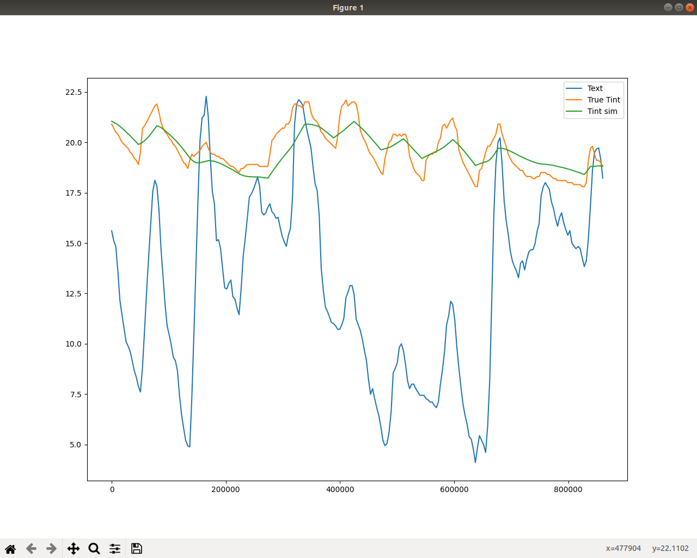

# RCmodel

check [the notebook](RCmodel.ipynb)

```
Optimization terminated successfully.
         Current function value: 0.284280
         Iterations: 36
         Function evaluations: 41
         Gradient evaluations: 41
      fun: 0.2842799203798105
 hess_inv: array([[ 2.89580415e+01, -1.04312969e+03],
       [-1.04312969e+03,  9.31453478e+04]])
      jac: array([-4.20192234e-07, -9.28975706e-09])
  message: 'Optimization terminated successfully.'
     nfev: 41
      nit: 36
     njev: 41
   status: 0
  success: True
        x: array([ 19.41147127, 200.26861781])
[1.94114713e-04 2.00268618e+09]
```


# pour en savoir plus sur l'équation de la chaleur

http://www.lmm.jussieu.fr/~lagree/COURS/MECAVENIR/
